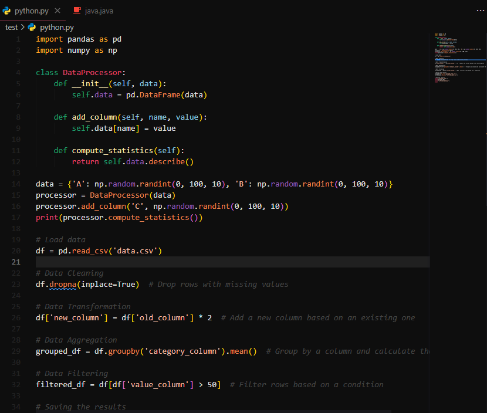
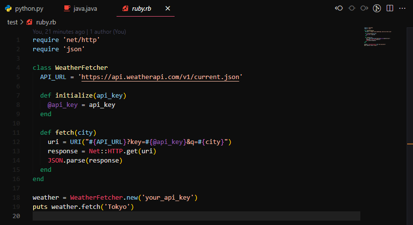
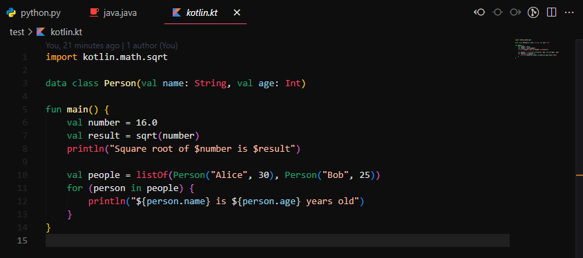
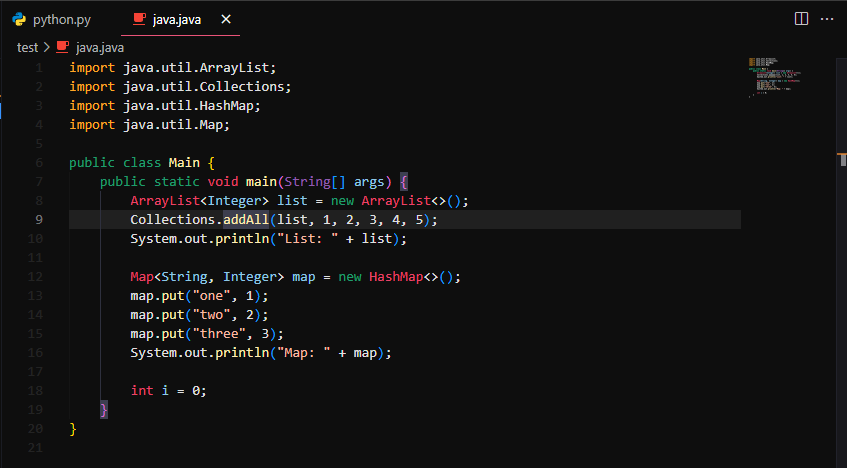

# Nightfall Pines

An elegant dark theme for Visual Studio Code.

<table>
    <tr>
        <td></td>
        <td></td>
    </tr>
    <tr>
        <td></td>
        <td></td>
    </tr>
</table>

## Features

- Elegant design with a dark palette
- High contrast for better readability
- Perfect for night owls and low-light environments

## Supported Languages

This theme currently supports the following languages:

- Java
- Kotlin
- Python
- Ruby
- JSON
- HTML
- CSS

## Installation

### Option 1:
1. Open the Extensions view (`Ctrl+Shift+X`).
2. Search for "Nightfall Pines".
3. Click "Install" to add the theme to your Visual Studio Code.

### Option 2:
Manually download the .vsix file from the release and install it in Visual Studio Code.

## Usage

To activate the theme:

1. Open the Command Palette (`Ctrl+Shift+P`).
2. Type "Color Theme" and select "Preferences: Color Theme".
3. Choose "Nightfall Pines" from the list.

## Contribution

Contributions are always welcome, regardless of the programming language you want to add. Just create a Pull Request! If you encounter any issues or have suggestions, feel free to open an issue on our GitHub repository.

## License

This project is licensed under the MIT License. See the LICENSE file for more details.
